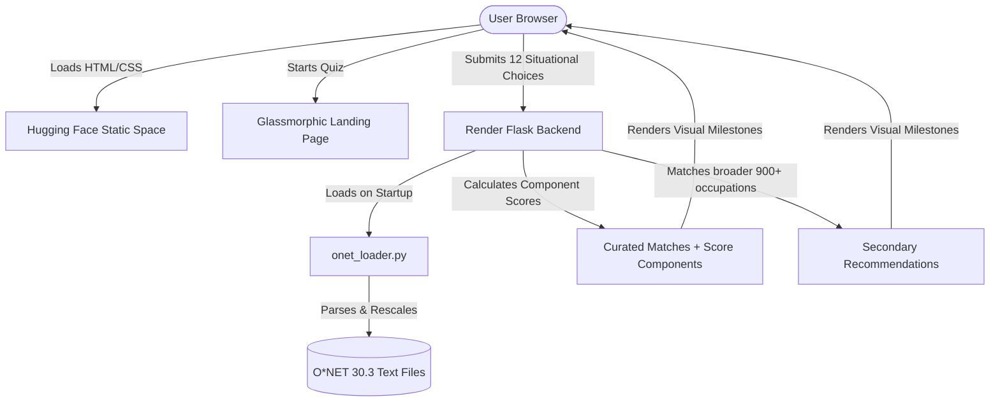

# PathFinder (CareerCompass) - Smart Career Exploration Engine

PathFinder is a premium, glassmorphism-based career exploration app designed to help users map out their natural traits, compare self-perceptions, and discover personalized career roadmaps.

## Live Deployments
- **Live Frontend (Hugging Face Spaces):** [https://ritikagada-pathfinder.hf.space/](https://ritikagada-pathfinder.hf.space/)
- **Live Backend (Render):** [https://pathfinder-backend-bzs6.onrender.com](https://pathfinder-backend-bzs6.onrender.com)

---

## 1. Application Architecture

The application is built using a decoupled **hybrid deployment model**:
1. **Frontend:** Hosted as a free Hugging Face Static Space (`index.html` + Vanilla CSS in `static/css/style.css`). It communicates with the backend via CORS-enabled Fetch API requests.
2. **Backend:** A containerized Flask application (`app.py` + Gunicorn) hosted on Render. It handles psychometric scoring, matches profiles against curated/broader O*NET databases, and computes self-judgement alignment metrics.

### System Diagram


---

## 2. Setup & Local Development

### Prerequisites
- Python 3.10 or higher
- Pip

### Local Installation
1. Clone the repository and navigate to the project directory:
   ```bash
   git clone https://github.com/Ritika-Gada/Path-Exploration-App.git
   cd Path-Exploration-App
   ```
2. Install the backend dependencies:
   ```bash
   pip install -r requirements.txt
   ```
3. Run the Flask backend locally:
   ```bash
   python3 app.py
   ```
   *The local server will start on `http://127.0.0.1:5001`.*
4. Serve or open `templates/index.html` in your browser. (The frontend dynamically switches target endpoints to `localhost` when run locally).

---

## 3. Psychometric Framework & O*NET Database Setup

PathFinder utilizes the validated **RIASEC** (Realistic, Investigative, Artistic, Social, Enterprising, Conventional) psychometric model.

### O*NET Source Data
The backend parses official government O*NET 30.3 database text files (located in `onet_data/db_30_3_text/`):
- `Career Interest Types.txt`: Standard RIASEC ratings (Scale ID `OI`) on a `1.0` to `7.0` scale.
- `Occupation Data.txt`: Maps O*NET-SOC codes to titles and description text.

### Rescaling Formula
O*NET's raw `1.0` to `7.0` scale values are linearly rescaled to PathFinder's internal `0.0` to `10.0` scale using:
$$y = \frac{x - 1.0}{6.0} \times 10.0$$
*This ensures alignment with user self-rating sliders (`0-10`) and ensures the integrity of the distance calculations.*

### 18-Career SOC Mapping Table
Curated careers in PathFinder are mapped to their official O*NET counterparts and updated at startup:

| Career ID | Name | O*NET-SOC Code | O*NET Title |
| :--- | :--- | :--- | :--- |
| `prompt_engineer` | Prompt Engineer | `15-2051.00` | Data Scientists |
| `mlops_specialist` | MLOps Specialist | `15-1299.08` | Computer Systems Engineers/Architects |
| `ux_ui_designer` | UX/UI Designer | `15-1255.00` | Web and Digital Interface Designers |
| `growth_marketer` | Growth Marketer | `13-1161.01` | Search Marketing Strategists |
| `data_analyst` | Data Analyst | `15-2051.01` | Business Intelligence Analysts |
| `product_manager` | Product Manager | `15-1299.09` | Information Technology Project Managers |
| `devrel_engineer` | DevRel Engineer | `15-1252.00` | Software Developers |
| `sustainability_consultant` | Sustainability Consultant | `13-1199.05` | Sustainability Specialists |
| `cybersecurity_analyst` | Cybersecurity Analyst | `15-1212.00` | Information Security Analysts |
| `blockchain_developer` | Blockchain Developer | `15-1299.07` | Blockchain Engineers |
| `ai_ethicist` | AI Ethicist | `15-1221.00` | Computer and Information Research Scientists |
| `customer_success_manager` | Customer Success Manager | `41-3091.00` | Sales Representatives of Services, All Other |
| `digital_content_strategist` | Digital Content Strategist | `27-3043.00` | Writers and Authors |
| `talent_acquisition_partner` | Talent Acquisition Partner | `13-1071.00` | Human Resources Specialists |
| `agile_scrum_master` | Agile Scrum Master | `13-1082.00` | Project Management Specialists |
| `fintech_financial_planner` | Fintech Financial Planner | `13-2052.00` | Personal Financial Advisors |
| `healthcare_informatics_spec`| Healthcare Informatics Specialist| `15-1211.01` | Health Informatics Specialists |
| `ecommerce_brand_manager` | E-commerce Brand Manager | `11-2021.00` | Marketing Managers |

---

## 4. Scoring Engine & Ablation Study

### Scoring Logic
PathFinder matches profiles using Manhattan Distance normalized to a percentage. Adjustments are applied component-wise and clamped:
- **Base Score:** Match against RIASEC database values.
- **Tag Bonus:** +4% per matching preferred tag.
- **Driver Bonus:** +10% if primary career motivator matches.
- **Barrier Adjustments:** Up to -15% penalty for high-barrier roles on low budget/flexibility, or up to +10% boost for low-barrier side paths.

### Ablation Evaluation Script
The script `eval_ablation.py` runs 5 distinct user profiles through the scoring engine and outputs a detailed breakdown of how each component affects the final score. 

To run the ablation study:
```bash
python3 eval_ablation.py
```

### Wider O*NET Pool Exploration
PathFinder loads all ~900 occupations in the O*NET pool. For any given user profile, if any occupation in the wider pool scores strictly higher than the top curated career, it is surfaced under a **"You might also explore..."** list, showing standard O*NET titles + scores with a "detailed path coming soon" placeholder.

---

## 5. Frontend UI Features

- **Glassmorphic Landing Page:** Serves as the entry point, explaining how the quiz works, detailing framework credibility (O*NET + RIASEC), and highlighting key features before starting the quiz.
- **Situational Questionnaire:** A 12-question quiz presenting real-life situations. The responses are compiled in JS to form the user's RIASEC profile.
- **Cold Start Spin-up Detector:** Since the backend is hosted on a free Render tier, it may sleep after inactivity. If the match API takes longer than 4 seconds, the UI dynamically alerts the user that a server spin-up is active.
- **Self-Judgement Alignment:** Compares the user's computed score with their slider self-ratings across Creativity, Logic, and Helping, printing a Signal Integrity score.

---

## 6. Verification Suite

All backend rules are verified using unit tests in `verify_app.py`.

To run the tests:
```bash
python3 verify_app.py
```
Tests include checks for:
- Financial penalty/bonus constraints.
- Milestones and situational quiz structures.
- Self-judgement alignment percentage calculations.
- Safe handling of null values (skipped quiz questions).
- O*NET overrides and score component integrity checks.

---

## 7. Machine Learning Pipeline

PathFinder uses a trained, explainable Logistic Regression model to combine user RIASEC similarity and tag overlap features into a base match probability score, replacing the original hand-tuned heuristic formula.

### Problem Framing
- **Goal:** Predict the probability that a given occupation is the user's correct fit.
- **Input Features:**
  1. `riasec_similarity`: Manhattan-based similarity percentage ($0-100\%$) between the user's RIASEC scores and the O*NET rescaled scores.
  2. `tag_overlap`: The count of matching tags ($0-10$) between user's likes (derived from resume keywords) and the occupation's tags.
- **Labels:** Positive label ($1$) represents the occupation mapped to the user's stated profession. Negative samples ($0$) are randomly selected (5 curated + 10 wider pool careers per user profile) to form a $15:1$ negative-to-positive training distribution.

### Data Source & Limitations
- **Source:** Kaggle Resume Dataset (962 profiles) mapped to equivalent O*NET codes.
- **Limitations & Proxies:**
  - RIASEC profiles are derived using case-insensitive keyword counts scaled to $0-10$, which serves as a proxy and not a validated psychometric measurement.
  - User likes tags are extracted independently from resume texts based on tag keyword frequencies.
  - Resumes do not contain signals for financial constraints or career motivation. Hence, `driver_bonus` and `barrier_adjustment` are kept rule-based by deliberate design rather than fabricated.

### Feature Standardization (Z-Scoring)
To ensure coefficients are comparable and explainable, raw features are standardized using parameters computed from the training set:
- **RIASEC Similarity:** Mean = `61.1772`, Std = `10.6462`
- **Tag Overlap:** Mean = `0.6981`, Std = `1.1706`

$$x_{\text{scaled}} = \frac{x - \mu}{\sigma}$$

### Model Coefficients & Explanations
The z-standardized coefficients trained on $769$ profiles (with $12,304$ samples) are:
- **Intercept ($\beta_0$):** `-3.0689`
- **RIASEC Similarity Coefficient ($\beta_1$):** `0.7422`
- **Tag Overlap Coefficient ($\beta_2$):** `0.3974`

**Key Interview Defense/Insight:**
- RIASEC similarity ($\beta_1 = 0.7422$) has roughly twice the predictive weight of tag overlap ($\beta_2 = 0.3974$) in identifying a user's stated career path.
- **Log-Odds Prior Shift Correction:** Since training used negative sampling ($15:1$ negative-to-positive ratio), the class distribution in the training set represents a biased prior where the positive class base rate is artificially low ($\tau_0 = 1/16 = 6.25\%$). In statistical modeling, training logistic regression under case-control / biased sampling yields consistent, unbiased slope coefficients ($\beta_1, \beta_2$), but biases the intercept ($\beta_0$) downward. To calibrate model output probabilities to reflect a realistic prior where a profile has an equal base rate of match/non-match ($\tau_1 = 0.5$), we apply the standard prior correction (e.g., King & Zeng, 2001) at inference by adjusting the intercept:
  $$\beta_{0,\text{corrected}} = \beta_0 - \log\left(\frac{\tau_0}{1 - \tau_0}\right) + \log\left(\frac{\tau_1}{1 - \tau_1}\right) = \beta_0 - \log(1/15) + \log(1) = \beta_0 + \log(15.0) \approx \beta_0 + 2.708$$
  This mathematically corrects for the sample selection bias, producing calibrated matching probabilities under the target prior distribution.

### Model Evaluation & Ablation
Evaluating the model against the original heuristic on the held-out test set ($193$ profiles, $1016$ O*NET candidate pool size) yielded:

| Metric | Random Chance | Heuristic Weights | Trained ML Model | Lift |
| :--- | :--- | :--- | :--- | :--- |
| **Top-5 Acc** | `0.492%` | `26.94%` | `28.50%` | **+1.55%** |
| **Top-10 Acc**| `0.984%` | `36.27%` | `39.38%` | **+3.11%** |

- **McNemar exact binomial p-value:** `0.2500` (contingency table: both correct = 52, model-only = 3, heuristic-only = 0, both incorrect = 138).
- **Statistical Power Caveat:** With only 3 discordant pairs (b=3, c=0), the test has low statistical power—so "not significant" means "we can't yet prove a difference with this sample size," not "we've proven there's no difference."

To run the full evaluation:
```bash
python3 eval_ablation.py
```

